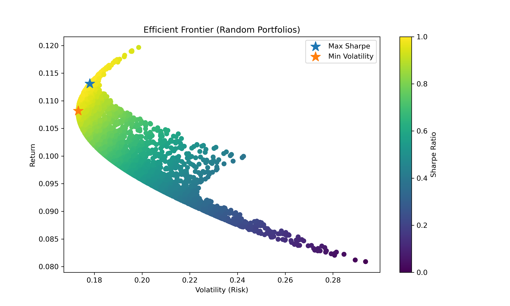

# Quant Finance Toolkit

A Python-based quant finance toolkit implementing key models used in portfolio optimization, derivatives pricing, and risk management.

## Features
- Markowitz Portfolio Optimization
- Efficient Frontier Generation
- Risk Parity Portfolio Construction
- Black-Scholes Option Pricing
- Monte Carlo Option Pricing
- Greeks Computation
- Value at Risk (VaR)
- Conditional Value at Risk (CVaR / Expected Shortfall)
- Backtesting Framework

## Tech Stack
- Python
- NumPy
- Pandas
- SciPy
- Matplotlib

## Repository Structure

## Efficient Frontier Example

